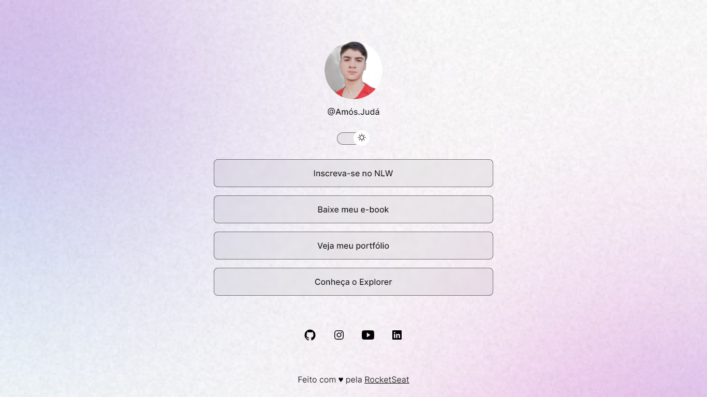

# Portfólio / link na bio
### Intuito do projeto-
- Criei esse projeto por meio da plataforma de ensino **Rocketseat** no Dev Links, afim de aprender e desenvolver técnicas de **Front-end**.

### O que eu utilizei-
- Utilizei para a criação-
**JS, HTML, CSS**
### Funcionalidades-
- Modo escuro e claro opcional modificado por botão.
- Botões reguláveis com links de acesso (dependendo do tamanho do dispositivo).
- Ícones de redes-sociais com link do perfil do usuário.
- Mudança de Foto do perfil .
### Screenshots-

- Modo escuro-

- Modo claro-
 